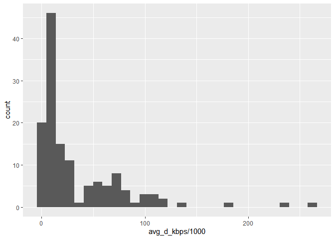

Ookla Speedtest Data 2020 Processing
================
Cary K. Jim

Data Source: Ookla on Github
<https://github.com/teamookla/ookla-open-data>

``` r
#Import libraries 
library(tidyverse)
```

    ## -- Attaching packages --------------------------------------- tidyverse 1.3.1 --

    ## v ggplot2 3.3.5     v purrr   0.3.4
    ## v tibble  3.1.6     v dplyr   1.0.7
    ## v tidyr   1.1.4     v stringr 1.4.0
    ## v readr   2.1.1     v forcats 0.5.1

    ## -- Conflicts ------------------------------------------ tidyverse_conflicts() --
    ## x dplyr::filter() masks stats::filter()
    ## x dplyr::lag()    masks stats::lag()

# Import datasets

These files are extracted from Ookla Open Data from AWS at US County
Level with Census tigris package in R that was pre-processed in Oct
2020. The original R script that processed these files is
Ookla_extract_county.R

Fixed speed result for all 4 quarters in 2020 from the raw file These
files are between 80 - 93MB each quarter and takes some time to load.

``` r
fixed_Q1_2020 <- read.csv("./Datasets/OOKLA/2020/raw_fixed_01v1.csv", header = T)
fixed_Q2_2020 <- read.csv("./Datasets/OOKLA/2020/raw_fixed_02v1.csv", header = T)
fixed_Q3_2020 <- read.csv("./Datasets/OOKLA/2020/raw_fixed_03v1.csv", header = T)
fixed_Q4_2020 <- read.csv("./Datasets/OOKLA/2020/raw_fixed_04v1.csv", header = T)
```

The summary of County Level Data aggregated with download, upload,
latency, devices_count, and test_county information.

geoid is the FIPS code in Census for the county. We can use it as County
ID. state_code is the corresponding number for the state.

``` r
head(fixed_Q1_2020)
```

    ##   state_code geoid   name      quadkey avg_d_kbps avg_u_kbps avg_lat_ms tests
    ## 1         31 31039 Cuming 2.133233e+14      10718       2131         22     4
    ## 2         31 31039 Cuming 2.133233e+14      66758      37803          7    32
    ## 3         31 31039 Cuming 2.133233e+14      29443       4983         31    17
    ## 4         31 31039 Cuming 2.133233e+14      52229       9782          4     5
    ## 5         31 31039 Cuming 2.133233e+14     119905      21948          5    37
    ## 6         31 31039 Cuming 2.133233e+14       4656       1018         10     3
    ##   devices
    ## 1       4
    ## 2       8
    ## 3       3
    ## 4       2
    ## 5       8
    ## 6       1

I’m curious to know just one of the distribution in the speed data for
Cuming

``` r
fixed_Q1_2020 %>% filter(geoid == 31039) %>% ggplot(aes(avg_d_kbps/1000)) + geom_histogram() 
```

    ## `stat_bin()` using `bins = 30`. Pick better value with `binwidth`.

<!-- -->
summary

``` r
fixed_Q1_2020 %>% filter(geoid == 31039) %>% summarise(download_mean = mean(avg_d_kbps))
```

    ##   download_mean
    ## 1      33837.27

# Merge all 4 QT in 2020

Combine all 4 quarters into one year for 2020.

``` r
fixed_2020 <- bind_rows(list(fixed_Q1_2020, fixed_Q2_2020, fixed_Q3_2020, 
                             fixed_Q4_2020), .id = "QT")
```

The merged raw data is about 339.1 MB, with 6834894 rows

View first 5 rows

``` r
head(fixed_2020)
```

    ##   QT state_code geoid   name      quadkey avg_d_kbps avg_u_kbps avg_lat_ms
    ## 1  1         31 31039 Cuming 2.133233e+14      10718       2131         22
    ## 2  1         31 31039 Cuming 2.133233e+14      66758      37803          7
    ## 3  1         31 31039 Cuming 2.133233e+14      29443       4983         31
    ## 4  1         31 31039 Cuming 2.133233e+14      52229       9782          4
    ## 5  1         31 31039 Cuming 2.133233e+14     119905      21948          5
    ## 6  1         31 31039 Cuming 2.133233e+14       4656       1018         10
    ##   tests devices
    ## 1     4       4
    ## 2    32       8
    ## 3    17       3
    ## 4     5       2
    ## 5    37       8
    ## 6     3       1

View last 5 rows

``` r
tail(fixed_2020)
```

    ##         QT state_code geoid  name      quadkey avg_d_kbps avg_u_kbps avg_lat_ms
    ## 6834889  4         54 54099 Wayne 3.200121e+14      31763      20921         21
    ## 6834890  4         54 54099 Wayne 3.200121e+14      22802      12631         37
    ## 6834891  4         54 54099 Wayne 3.200121e+14      42506       5776         16
    ## 6834892  4         54 54099 Wayne 3.200121e+14      67318      18441         15
    ## 6834893  4         54 54099 Wayne 3.200121e+14      41837       3554        939
    ## 6834894  4         54 54099 Wayne 3.200121e+14       2419        380        131
    ##         tests devices
    ## 6834889     1       1
    ## 6834890     1       1
    ## 6834891     1       1
    ## 6834892     1       1
    ## 6834893     1       1
    ## 6834894     1       1

## Missing values in the raw data

``` r
fixed_2020[!complete.cases(fixed_2020),]
```

    ##         QT state_code geoid             name quadkey avg_d_kbps avg_u_kbps
    ## 215970   1         46 46097            Miner      NA         NA         NA
    ## 428432   1         21 21189           Owsley      NA         NA         NA
    ## 787187   1         17 17069           Hardin      NA         NA         NA
    ## 850423   1         46 46021         Campbell      NA         NA         NA
    ## 1029932  1         69 69085 Northern Islands      NA         NA         NA
    ## 1121815  1          2  2013   Aleutians East      NA         NA         NA
    ## 1244565  1         46 46017          Buffalo      NA         NA         NA
    ## 1403997  1          2  2282          Yakutat      NA         NA         NA
    ## 1444357  1         48 48269             King      NA         NA         NA
    ## 1469329  1         29 29199         Scotland      NA         NA         NA
    ## 1533579  1          8  8061            Kiowa      NA         NA         NA
    ## 1629809  1         46 46111          Sanborn      NA         NA         NA
    ## 1663970  1         60 60040    Swains Island      NA         NA         NA
    ## 1729366  1         60 60030      Rose Island      NA         NA         NA
    ## 1791541  2         31 31015             Boyd      NA         NA         NA
    ## 1959494  2         46 46097            Miner      NA         NA         NA
    ## 1959495  2         46 46073          Jerauld      NA         NA         NA
    ## 2080532  2         46 46119            Sully      NA         NA         NA
    ## 2257286  2         60 60020           Manu'a      NA         NA         NA
    ## 2613660  2         46 46021         Campbell      NA         NA         NA
    ## 2893116  2          2  2013   Aleutians East      NA         NA         NA
    ## 3009187  2         13 13269           Taylor      NA         NA         NA
    ## 3082451  2          2  2016   Aleutians West      NA         NA         NA
    ## 3154454  2         48 48263             Kent      NA         NA         NA
    ## 3179474  2          2  2282          Yakutat      NA         NA         NA
    ## 3220816  2         48 48269             King      NA         NA         NA
    ## 3411321  2         46 46111          Sanborn      NA         NA         NA
    ## 3446243  2         60 60040    Swains Island      NA         NA         NA
    ## 3460202  2         46 46091         Marshall      NA         NA         NA
    ## 3513705  2         60 60030      Rose Island      NA         NA         NA
    ## 3742084  3         46 46097            Miner      NA         NA         NA
    ## 3742085  3         46 46073          Jerauld      NA         NA         NA
    ## 3788039  3         46 46137          Ziebach      NA         NA         NA
    ## 4036697  3         60 60020           Manu'a      NA         NA         NA
    ## 4389113  3         46 46021         Campbell      NA         NA         NA
    ## 4571452  3         69 69085 Northern Islands      NA         NA         NA
    ## 4665477  3          2  2013   Aleutians East      NA         NA         NA
    ## 4788946  3         46 46017          Buffalo      NA         NA         NA
    ## 4818411  3         46 46107           Potter      NA         NA         NA
    ## 4853456  3          2  2016   Aleutians West      NA         NA         NA
    ## 4869244  3         46 46069             Hyde      NA         NA         NA
    ## 4949583  3          2  2282          Yakutat      NA         NA         NA
    ## 4989735  3         48 48269             King      NA         NA         NA
    ## 5178393  3         46 46111          Sanborn      NA         NA         NA
    ## 5212309  3         60 60040    Swains Island      NA         NA         NA
    ## 5279287  3         60 60030      Rose Island      NA         NA         NA
    ## 5334165  4         31 31015             Boyd      NA         NA         NA
    ## 5366932  4         13 13265       Taliaferro      NA         NA         NA
    ## 5396369  4         31 31103        Keya Paha      NA         NA         NA
    ## 5481378  4         46 46097            Miner      NA         NA         NA
    ## 5481379  4         46 46073          Jerauld      NA         NA         NA
    ## 5520439  4         46 46137          Ziebach      NA         NA         NA
    ## 5585652  4         46 46119            Sully      NA         NA         NA
    ## 5669876  4         21 21189           Owsley      NA         NA         NA
    ## 6045872  4         46 46021         Campbell      NA         NA         NA
    ## 6204484  4         69 69085 Northern Islands      NA         NA         NA
    ## 6287019  4          2  2013   Aleutians East      NA         NA         NA
    ## 6396489  4         46 46017          Buffalo      NA         NA         NA
    ## 6453238  4          2  2016   Aleutians West      NA         NA         NA
    ## 6467220  4         46 46069             Hyde      NA         NA         NA
    ## 6538779  4          2  2282          Yakutat      NA         NA         NA
    ## 6541822  4         48 48125          Dickens      NA         NA         NA
    ## 6665777  4         13 13317           Wilkes      NA         NA         NA
    ## 6737970  4         46 46111          Sanborn      NA         NA         NA
    ## 6768277  4         60 60040    Swains Island      NA         NA         NA
    ## 6827121  4         60 60030      Rose Island      NA         NA         NA
    ##         avg_lat_ms tests devices
    ## 215970          NA    NA      NA
    ## 428432          NA    NA      NA
    ## 787187          NA    NA      NA
    ## 850423          NA    NA      NA
    ## 1029932         NA    NA      NA
    ## 1121815         NA    NA      NA
    ## 1244565         NA    NA      NA
    ## 1403997         NA    NA      NA
    ## 1444357         NA    NA      NA
    ## 1469329         NA    NA      NA
    ## 1533579         NA    NA      NA
    ## 1629809         NA    NA      NA
    ## 1663970         NA    NA      NA
    ## 1729366         NA    NA      NA
    ## 1791541         NA    NA      NA
    ## 1959494         NA    NA      NA
    ## 1959495         NA    NA      NA
    ## 2080532         NA    NA      NA
    ## 2257286         NA    NA      NA
    ## 2613660         NA    NA      NA
    ## 2893116         NA    NA      NA
    ## 3009187         NA    NA      NA
    ## 3082451         NA    NA      NA
    ## 3154454         NA    NA      NA
    ## 3179474         NA    NA      NA
    ## 3220816         NA    NA      NA
    ## 3411321         NA    NA      NA
    ## 3446243         NA    NA      NA
    ## 3460202         NA    NA      NA
    ## 3513705         NA    NA      NA
    ## 3742084         NA    NA      NA
    ## 3742085         NA    NA      NA
    ## 3788039         NA    NA      NA
    ## 4036697         NA    NA      NA
    ## 4389113         NA    NA      NA
    ## 4571452         NA    NA      NA
    ## 4665477         NA    NA      NA
    ## 4788946         NA    NA      NA
    ## 4818411         NA    NA      NA
    ## 4853456         NA    NA      NA
    ## 4869244         NA    NA      NA
    ## 4949583         NA    NA      NA
    ## 4989735         NA    NA      NA
    ## 5178393         NA    NA      NA
    ## 5212309         NA    NA      NA
    ## 5279287         NA    NA      NA
    ## 5334165         NA    NA      NA
    ## 5366932         NA    NA      NA
    ## 5396369         NA    NA      NA
    ## 5481378         NA    NA      NA
    ## 5481379         NA    NA      NA
    ## 5520439         NA    NA      NA
    ## 5585652         NA    NA      NA
    ## 5669876         NA    NA      NA
    ## 6045872         NA    NA      NA
    ## 6204484         NA    NA      NA
    ## 6287019         NA    NA      NA
    ## 6396489         NA    NA      NA
    ## 6453238         NA    NA      NA
    ## 6467220         NA    NA      NA
    ## 6538779         NA    NA      NA
    ## 6541822         NA    NA      NA
    ## 6665777         NA    NA      NA
    ## 6737970         NA    NA      NA
    ## 6768277         NA    NA      NA
    ## 6827121         NA    NA      NA

There are 66 rows of missing values in the dataset.

By looking at the state codes, the dataset included US territories. Guam
and Northern Mariana Islands have county 69085, 69110, 69120, 69100,
66010

I’m going to remove the US territories first and then add state name to
it.

## Drop U.S. Territories in the dataset

``` r
fixed_2020 <- fixed_2020[!(fixed_2020$state_code == "69" | fixed_2020$state_code == "60"), ]
```

The rows has reduced to 6833755 after dropping either 69(MP) or 60(AS).

## Aggregate the county level data

``` r
fixed_2020_Q <- fixed_2020 %>% group_by(QT, state_code, geoid, name) %>%
  summarise(avg_d_Mbps = mean(avg_d_kbps)/1000, 
            avg_u_Mbps = mean(avg_u_kbps)/1000,
            avg_latency = mean(avg_lat_ms),
            tests_count = sum(tests),
            devices_count = sum(devices)) 
```

    ## `summarise()` has grouped output by 'QT', 'state_code', 'geoid'. You can
    ## override using the `.groups` argument.

The dataset is down to 12896 rows

``` r
summary(fixed_2020_Q)
```

    ##       QT              state_code        geoid           name          
    ##  Length:12896       Min.   : 1.00   Min.   : 1001   Length:12896      
    ##  Class :character   1st Qu.:19.00   1st Qu.:19035   Class :character  
    ##  Mode  :character   Median :30.00   Median :30028   Mode  :character  
    ##                     Mean   :31.34   Mean   :31448                     
    ##                     3rd Qu.:46.00   3rd Qu.:46112                     
    ##                     Max.   :78.00   Max.   :78030                     
    ##                                                                       
    ##    avg_d_Mbps        avg_u_Mbps       avg_latency       tests_count     
    ##  Min.   :  1.314   Min.   :  0.187   Min.   :   2.60   Min.   :      1  
    ##  1st Qu.: 39.797   1st Qu.:  9.073   1st Qu.:  31.08   1st Qu.:    473  
    ##  Median : 68.326   Median : 14.234   Median :  49.58   Median :   1480  
    ##  Mean   : 74.158   Mean   : 23.006   Mean   :  66.23   Mean   :   8673  
    ##  3rd Qu.:104.195   3rd Qu.: 28.096   3rd Qu.:  80.84   3rd Qu.:   4718  
    ##  Max.   :329.066   Max.   :229.422   Max.   :1058.00   Max.   :1598873  
    ##  NA's   :53        NA's   :53        NA's   :53        NA's   :53       
    ##  devices_count     
    ##  Min.   :     1.0  
    ##  1st Qu.:   148.5  
    ##  Median :   447.0  
    ##  Mean   :  2380.1  
    ##  3rd Qu.:  1394.5  
    ##  Max.   :355779.0  
    ##  NA's   :53

There are still missing values and after joining the state, we should
have a better idea of where they are located. (NA’s: 53)

## List of state code and abbreviation

``` r
list <-read.delim("./Utility/StateCodeList.txt", header = T, sep = " ")
list <- list[1:3]
list$FIPS <- as.numeric(list$FIPS)
```

Left-Join

``` r
left_join(fixed_2020_Q, list, by = c("state_code" = "FIPS"))
```

    ## # A tibble: 12,896 x 11
    ## # Groups:   QT, state_code, geoid [12,896]
    ##    QT    state_code geoid name     avg_d_Mbps avg_u_Mbps avg_latency tests_count
    ##    <chr>      <dbl> <int> <chr>         <dbl>      <dbl>       <dbl>       <int>
    ##  1 1              1  1001 Autauga       111.       40.5         47.4        4447
    ##  2 1              1  1003 Baldwin        77.7      30.6         74.1       21202
    ##  3 1              1  1005 Barbour        66.9       9.13        87.7         467
    ##  4 1              1  1007 Bibb           42.3      28.7         76.7         749
    ##  5 1              1  1009 Blount         60.9      21.4         47.9        4501
    ##  6 1              1  1011 Bullock        16.2       6.04        63.8         174
    ##  7 1              1  1013 Butler         49.5       9.81        51.0         446
    ##  8 1              1  1015 Calhoun       107.       22.8         42.7        5191
    ##  9 1              1  1017 Chambers       96.2      13.2         57.3        1443
    ## 10 1              1  1019 Cherokee       30.8       6.36        88.4        1568
    ## # ... with 12,886 more rows, and 3 more variables: devices_count <int>,
    ## #   State <chr>, Abbr <chr>

## Export the Quarterly cleaned Fixed 2020 dataset

``` r
write.csv(fixed_2020_Q, "./Export/ookla/Yearly/Fixed_2020_Q.csv", row.names = F)
```

References: - Use Census geographic data in R with tigris
<https://walker-data.com/tigris-webinar/#1> - Downloading Census blocks
shapefile in R <https://rdrr.io/cran/tigris/man/blocks.html> - Filter
and plot at the same time
<https://stackoverflow.com/questions/59273929/r-how-to-filter-data-with-a-list-of-arguments-to-produce-multiple-data-frames>
-Histogram in Tidyverse ggplot
<https://ggplot2.tidyverse.org/reference/geom_histogram.html>
